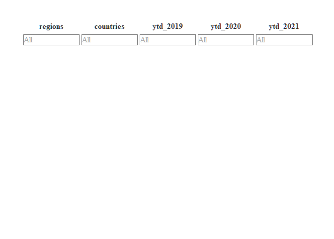
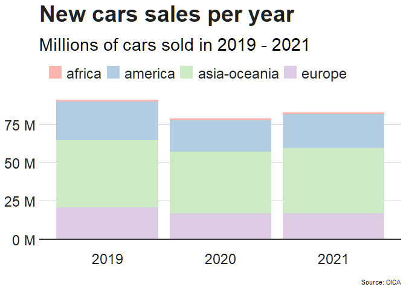
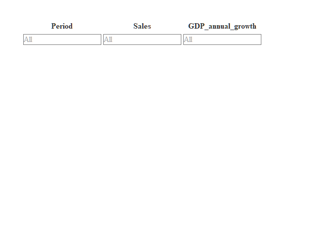
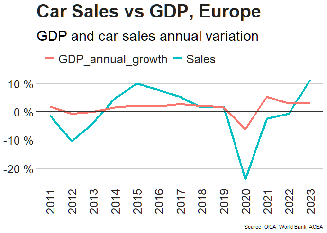

Google Data Analytics Capstone: New car sales 2019-2021. How COVID
impacted the industry?
================
Boris Kosarenkov
2022-10-17

## Ask

In this capstone project, I will explore the new car sales and its COVID
impact. My target is to understand when the industry will be able to
come back to the pre-COVID level of 2019. Stakeholders are Global Supply
Chain Management of one of the major automotive parts manufacturers. The
business task is to analyze the automotive market and help stakeholders
perform demand arbitration and inventory strategy for 2023.

## Prepare

I will use data from “Organisation Internationale des Constructeurs
d’Automobiles” (OICA), The European Automobile Manufacturers’
Association, or ACEA, and The World Bank. This paper is created for
educational, research purposes, which falls under exceptions to French
copyright law, described in Art. L122-5. The World Bank strives to
enhance public access to and use of data that it collects and publishes
([detailed terms of
use](https://www.worldbank.org/en/about/legal/terms-of-use-for-datasets))

- Data-sets & citations:

  - Global Sales - All Vehicles from OICA, [OICA web-site](www.oica.net)

  - Vehicle sales mirror economic growth (2008-2021 trend), [ACEA
    web-site](www.acea.auto)

  - The Wrold Bank: GDP growth (annual %),[The World Bank
    web-site](data.worldbank.org)

## Process

For Data processing, cleaning and analyze I will use Excel and R studio
cloud. Excel is chosen as it fits very well for initial review of the
data and making assumptions. I have significant experience with Excel,
so it is faster and easier for me to make a quick initial data review. R
programming language and R studio IDE is chosen because it has great
capabilities in both data processing, transformation, and visualization.
R markdown format allows to output professional reports in HTML. Same
analyze and visualization could have been performed fully in Excel, or
in Google Big Query (using SQL) and Google data studio or Tableu for
visualization.

Technical documentation logging cleaning and manipulation of data is
available on
[Kaggle](https://www.kaggle.com/code/boriskosarenkov/google-data-analytics-car-sales-and-covid-impact)

## Analyze

I have prepared two data-sets. I used excel to delete and or modify
column names, delete unnecessary visual formatting, and to save data
sets as CSV files. In the next step I’m using R to load those CSV files
into IDE. I use tidyverse package to manipulate data in R, I had to
pivot longer one of the data sets in order to be able to build the
required visualization. I use DT package to make the advanced visual
output of the resulting tables. For charts, I use ggplot2 with a style
package created by [BBC bbplot package](https://github.com/bbc/bbplot).

First data set: Global Sales - All Vehicles

- It contains new vehicle sales per country and region for the period
  2019 - 2021

<!-- -->

- It allows me (after some pivoting) to build a column chart
  representing the drop in sales in 2020

<!-- -->

    ## Warning in grid.Call(C_stringMetric, as.graphicsAnnot(x$label)): семейство
    ## шрифтов не найдено в базе данных шрифтов Windows

    ## Warning in grid.Call(C_stringMetric, as.graphicsAnnot(x$label)): семейство
    ## шрифтов не найдено в базе данных шрифтов Windows

    ## Warning in grid.Call(C_stringMetric, as.graphicsAnnot(x$label)): семейство
    ## шрифтов не найдено в базе данных шрифтов Windows

    ## Warning in grid.Call(C_textBounds, as.graphicsAnnot(x$label), x$x, x$y, :
    ## семейство шрифтов не найдено в базе данных шрифтов Windows

    ## Warning in grid.Call(C_textBounds, as.graphicsAnnot(x$label), x$x, x$y, :
    ## семейство шрифтов не найдено в базе данных шрифтов Windows

    ## Warning in grid.Call(C_textBounds, as.graphicsAnnot(x$label), x$x, x$y, :
    ## семейство шрифтов не найдено в базе данных шрифтов Windows

    ## Warning in grid.Call(C_textBounds, as.graphicsAnnot(x$label), x$x, x$y, :
    ## семейство шрифтов не найдено в базе данных шрифтов Windows

    ## Warning in grid.Call(C_textBounds, as.graphicsAnnot(x$label), x$x, x$y, :
    ## семейство шрифтов не найдено в базе данных шрифтов Windows

    ## Warning in grid.Call(C_textBounds, as.graphicsAnnot(x$label), x$x, x$y, :
    ## семейство шрифтов не найдено в базе данных шрифтов Windows

    ## Warning in grid.Call(C_textBounds, as.graphicsAnnot(x$label), x$x, x$y, :
    ## семейство шрифтов не найдено в базе данных шрифтов Windows

    ## Warning in grid.Call(C_textBounds, as.graphicsAnnot(x$label), x$x, x$y, :
    ## семейство шрифтов не найдено в базе данных шрифтов Windows

    ## Warning in grid.Call(C_textBounds, as.graphicsAnnot(x$label), x$x, x$y, :
    ## семейство шрифтов не найдено в базе данных шрифтов Windows

    ## Warning in grid.Call(C_textBounds, as.graphicsAnnot(x$label), x$x, x$y, :
    ## семейство шрифтов не найдено в базе данных шрифтов Windows

<!-- -->

Second data set: GDP growth correlation with new vehicle sales

- It was made using data from The World Bank for GDP annual growth and
  data from OICA for vehicle sales. An article from ACEA provided the
  insight that correlation exists

<!-- -->

- Line chart helps to demonstrate the assumed correlation

<!-- -->

    ## Warning in grid.Call(C_textBounds, as.graphicsAnnot(x$label), x$x, x$y, :
    ## семейство шрифтов не найдено в базе данных шрифтов Windows

    ## Warning in grid.Call(C_textBounds, as.graphicsAnnot(x$label), x$x, x$y, :
    ## семейство шрифтов не найдено в базе данных шрифтов Windows

    ## Warning in grid.Call(C_textBounds, as.graphicsAnnot(x$label), x$x, x$y, :
    ## семейство шрифтов не найдено в базе данных шрифтов Windows

    ## Warning in grid.Call(C_textBounds, as.graphicsAnnot(x$label), x$x, x$y, :
    ## семейство шрифтов не найдено в базе данных шрифтов Windows

    ## Warning in grid.Call(C_textBounds, as.graphicsAnnot(x$label), x$x, x$y, :
    ## семейство шрифтов не найдено в базе данных шрифтов Windows

    ## Warning in grid.Call(C_textBounds, as.graphicsAnnot(x$label), x$x, x$y, :
    ## семейство шрифтов не найдено в базе данных шрифтов Windows

    ## Warning in grid.Call(C_textBounds, as.graphicsAnnot(x$label), x$x, x$y, :
    ## семейство шрифтов не найдено в базе данных шрифтов Windows

    ## Warning in grid.Call(C_textBounds, as.graphicsAnnot(x$label), x$x, x$y, :
    ## семейство шрифтов не найдено в базе данных шрифтов Windows

    ## Warning in grid.Call.graphics(C_text, as.graphicsAnnot(x$label), x$x, x$y, :
    ## семейство шрифтов не найдено в базе данных шрифтов Windows

    ## Warning in grid.Call.graphics(C_text, as.graphicsAnnot(x$label), x$x, x$y, :
    ## семейство шрифтов не найдено в базе данных шрифтов Windows

    ## Warning in grid.Call.graphics(C_text, as.graphicsAnnot(x$label), x$x, x$y, :
    ## семейство шрифтов не найдено в базе данных шрифтов Windows

    ## Warning in grid.Call.graphics(C_text, as.graphicsAnnot(x$label), x$x, x$y, :
    ## семейство шрифтов не найдено в базе данных шрифтов Windows

    ## Warning in grid.Call.graphics(C_text, as.graphicsAnnot(x$label), x$x, x$y, :
    ## семейство шрифтов не найдено в базе данных шрифтов Windows

    ## Warning in grid.Call.graphics(C_text, as.graphicsAnnot(x$label), x$x, x$y, :
    ## семейство шрифтов не найдено в базе данных шрифтов Windows

    ## Warning in grid.Call.graphics(C_text, as.graphicsAnnot(x$label), x$x, x$y, :
    ## семейство шрифтов не найдено в базе данных шрифтов Windows

    ## Warning in grid.Call.graphics(C_text, as.graphicsAnnot(x$label), x$x, x$y, :
    ## семейство шрифтов не найдено в базе данных шрифтов Windows

    ## Warning in grid.Call.graphics(C_text, as.graphicsAnnot(x$label), x$x, x$y, :
    ## семейство шрифтов не найдено в базе данных шрифтов Windows

    ## Warning in grid.Call.graphics(C_text, as.graphicsAnnot(x$label), x$x, x$y, :
    ## семейство шрифтов не найдено в базе данных шрифтов Windows

    ## Warning in grid.Call.graphics(C_text, as.graphicsAnnot(x$label), x$x, x$y, :
    ## семейство шрифтов не найдено в базе данных шрифтов Windows

    ## Warning in grid.Call.graphics(C_text, as.graphicsAnnot(x$label), x$x, x$y, :
    ## семейство шрифтов не найдено в базе данных шрифтов Windows

    ## Warning in grid.Call.graphics(C_text, as.graphicsAnnot(x$label), x$x, x$y, :
    ## семейство шрифтов не найдено в базе данных шрифтов Windows

    ## Warning in grid.Call.graphics(C_text, as.graphicsAnnot(x$label), x$x, x$y, :
    ## семейство шрифтов не найдено в базе данных шрифтов Windows

    ## Warning in grid.Call.graphics(C_text, as.graphicsAnnot(x$label), x$x, x$y, :
    ## семейство шрифтов не найдено в базе данных шрифтов Windows

    ## Warning in grid.Call.graphics(C_text, as.graphicsAnnot(x$label), x$x, x$y, :
    ## семейство шрифтов не найдено в базе данных шрифтов Windows

    ## Warning in grid.Call.graphics(C_text, as.graphicsAnnot(x$label), x$x, x$y, :
    ## семейство шрифтов не найдено в базе данных шрифтов Windows

    ## Warning in grid.Call.graphics(C_text, as.graphicsAnnot(x$label), x$x, x$y, :
    ## семейство шрифтов не найдено в базе данных шрифтов Windows

    ## Warning in grid.Call.graphics(C_text, as.graphicsAnnot(x$label), x$x, x$y, :
    ## семейство шрифтов не найдено в базе данных шрифтов Windows

    ## Warning in grid.Call.graphics(C_text, as.graphicsAnnot(x$label), x$x, x$y, :
    ## семейство шрифтов не найдено в базе данных шрифтов Windows

    ## Warning in grid.Call.graphics(C_text, as.graphicsAnnot(x$label), x$x, x$y, :
    ## семейство шрифтов не найдено в базе данных шрифтов Windows

    ## Warning in grid.Call.graphics(C_text, as.graphicsAnnot(x$label), x$x, x$y, :
    ## семейство шрифтов не найдено в базе данных шрифтов Windows

    ## Warning in grid.Call.graphics(C_text, as.graphicsAnnot(x$label), x$x, x$y, :
    ## семейство шрифтов не найдено в базе данных шрифтов Windows

    ## Warning in grid.Call.graphics(C_text, as.graphicsAnnot(x$label), x$x, x$y, :
    ## семейство шрифтов не найдено в базе данных шрифтов Windows

    ## Warning in grid.Call.graphics(C_text, as.graphicsAnnot(x$label), x$x, x$y, :
    ## семейство шрифтов не найдено в базе данных шрифтов Windows

    ## Warning in grid.Call(C_textBounds, as.graphicsAnnot(x$label), x$x, x$y, :
    ## семейство шрифтов не найдено в базе данных шрифтов Windows

    ## Warning in grid.Call(C_textBounds, as.graphicsAnnot(x$label), x$x, x$y, :
    ## семейство шрифтов не найдено в базе данных шрифтов Windows

    ## Warning in grid.Call(C_textBounds, as.graphicsAnnot(x$label), x$x, x$y, :
    ## семейство шрифтов не найдено в базе данных шрифтов Windows

<!-- -->

## Act

- Data shows almost 24% drop in new car sales in 2020 comparing to 2019.
  The reduction is related to COVID pandemic impact on customer demand
  and on the whole automotive supply chain. Car manufacturers and
  component suppliers suffered production shutdowns due to quarantines.
- Data shows that there is an above average correlation between car
  sales and GDP growth. See chart.  
- On the same chart we can see that in 2020 car sales “overreact” - drop
  significantly lower in comparison to the decline in actual economic
  emissions (GDP). “Overreaction” can be caused by:  
  - Panic of consumers  

  - Showrooms closed  

  - Manufacturer’s production output reduced due to crisis in supply
    chain  
- World Bank estimates only 3.5% annual growth of GDP in 2023 and
  in 2024. With such pace market will comeback top the 2019 (pre-COVID)
  levels on in 2024

If stakeholders get a demand forecast from car makers (their customers)
which contradicts above described insights, and for example shows sales
growth above 3-4% next year it should raise questions for further
analysis:

- Is this carmaker or vehicle model outpacing the market? Did it ever
  before?

- Is the region model is targeted for outpacing the market? For example,
  China is and it is estimated that it will in 2023 as well.

If none of the above is true I suggest stakeholders to be conservative
in their demand arbitration process for 2023, so they could avoid
overstocking.
